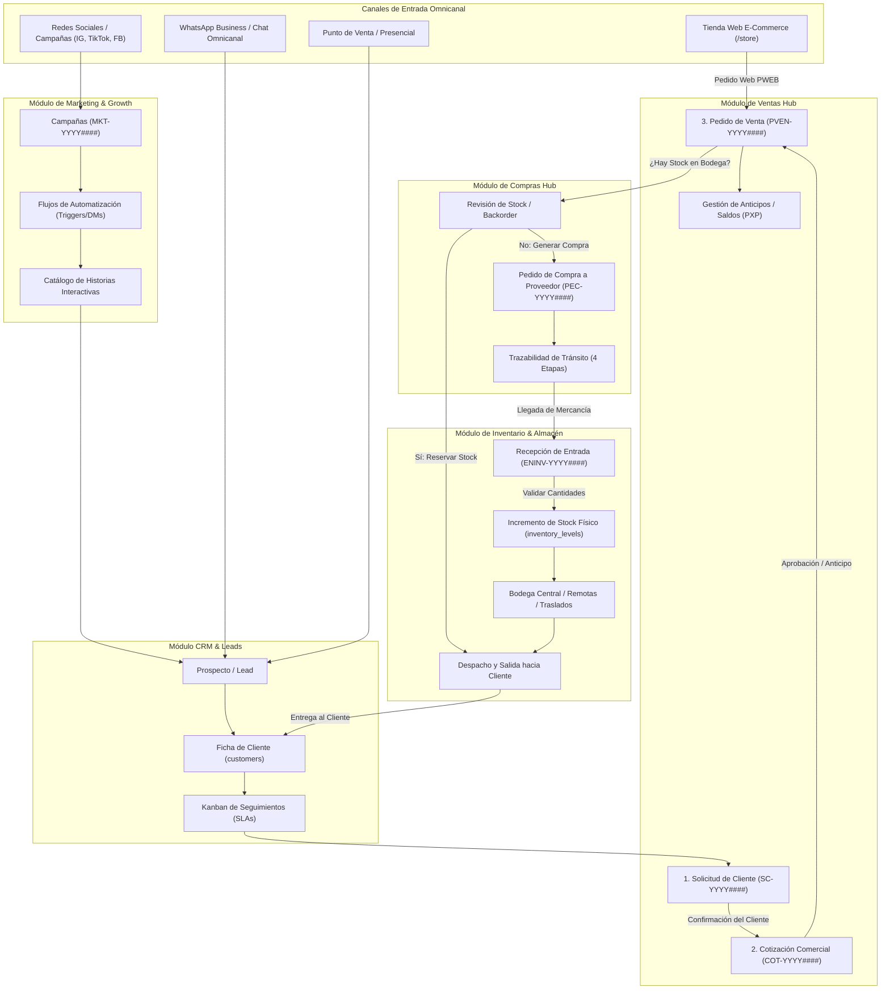
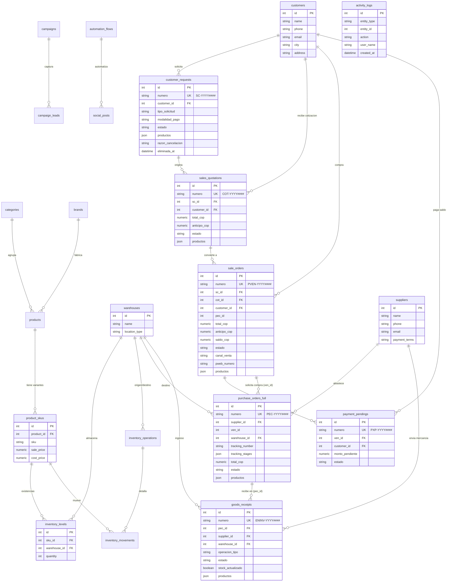
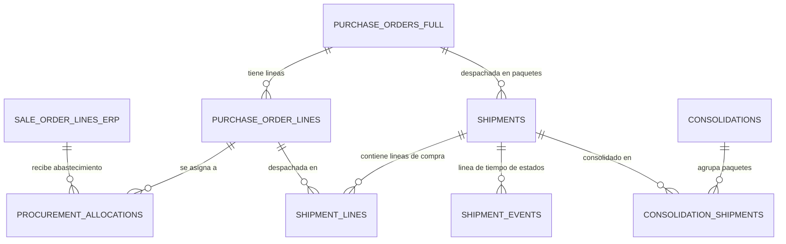

# Arquitectura, Lógica de Negocio y Flujo Integral del Sistema ERP-CRM Nebulae Kids

> **Versión del Sistema:** 2.0 (Fase 15 Culminada)  
> **Fecha de Actualización:** Septiembre 2026  
> **Propósito del Documento:** Detallar de manera exhaustiva la arquitectura técnica, modelos de datos relacionales, secciones de interfaz, lógica de negocio y el flujo cardinal de integración entre **Inventario ⇄ Venta ⇄ Compra ⇄ Inventario**, así como la interacción con **CRM, E-Commerce y Marketing**.

---

## 1. Visión General y Ecosistema de la Solución

Nebulae Kids ERP-CRM es una plataforma integral omnicanal diseñada para orquestar la totalidad del ciclo de vida del negocio:
1. **Atracción y Marketing:** Campañas multicanal, flujos de automatización de redes sociales (Community Manager) y catálogo interactivo de historias.
2. **Captura y CRM:** Bandeja de entrada omnicanal (WhatsApp, Instagram, Web, Presencial), gestión de clientes y seguimiento Kanban de leads.
3. **Comercialización (Ventas):** Pipeline estructurado de Solicitud de Cliente (`SC`), Cotización Comercial (`COT`), Pedido de Venta (`VEN`/`PVEN`) y Cobros Pendientes (`PXP`).
4. **Abastecimiento (Compras):** Pedidos de Compra (`PEC`) con proveedores nacionales e internacionales, trazabilidad de importación/tránsito en 4 etapas, y listas de reabastecimiento.
5. **Operaciones y Almacén (Inventario):** Recepciones de Inventario (`ENINV`), bodegas múltiples, niveles de stock por SKU, traslados internos y alertas de inventario mínimo.
6. **Canal Digital (E-Commerce):** Tienda virtual pública (`/store`), sincronización de pedidos web (`PWEB`), recuperación de carritos abandonados y constructor web asistido por IA (`web-builder`).
7. **Capa de Inteligencia Artificial:** Paneles contextuales (`IAPanel`) en cada documento para diagnóstico de trazabilidad, evaluación de garantías/devoluciones, analítica predictiva y asistente conversacional.

---

## 2. Diagrama de Flujo de Alto Nivel de la Solución

El siguiente diagrama ilustra cómo interactúan los clientes, asesores, canales de venta y bodegas a través de los diferentes módulos del sistema:



---

## 3. El Ciclo Cardinal: Inventario ⇄ Venta ⇄ Compra ⇄ Inventario

Este bucle es el motor central del ERP. La información nunca se duplica de forma aislada; cada documento hereda y alimenta al siguiente eslabón.

```
       ┌────────────────────────────────────────────────────────┐
       │                                                        │
       ▼                                                        │
┌──────────────┐       ┌──────────────┐       ┌──────────────┐  │
│  INVENTARIO  │ ────► │    VENTAS    │ ────► │   COMPRAS    │ ─┘
│  (Stock/SKU) │       │ (SC/COT/VEN) │       │  (PEC/Trans) │
└──────────────┘       └──────────────┘       └──────────────┘
```

### Paso 1: Inventario Base y Catálogo
- **Estructura:** Modelos `Product`, `ProductSKU`, `Warehouse`, `InventoryLevel`.
- **Lógica:** Cada producto puede tener múltiples SKUs (variantes de talla, color, etc.) y estar alojado en distintas bodegas (`Central`, `Remota`, `Consignación`).
- **Nutrición:** Define qué artículos están disponibles para cotizar en el CRM, publicar en el E-Commerce (`store`) o programar en las Historias de Marketing.

### Paso 2: Solicitud de Cliente (`customer_requests` - SC)
- **Generación:** Se origina desde el CRM, chat de WhatsApp, una historia de Instagram o mostrador.
- **Tipos de Solicitud:**
  - `Cotizacion de Producto` (Habilita campo de Modalidad de Pago: Contado, 60/40, Crédito).
  - `Seguimiento` (Oculta modalidad de pago; IA despliega trazabilidad del pedido en curso).
  - `Devolucion de Producto` (Oculta modalidad de pago; IA valida políticas de garantía).
  - `Programar Entrega`, `Nuevo Lead`, `Soporte Tecnico`.
- **Nutrición hacia adelante:** Al hacer clic en "Confirmar + Crear COT", el sistema traslada automáticamente los datos del cliente y la lista de productos pre-cargados a una nueva Cotización.

### Paso 3: Cotización Comercial (`sales_quotations` - COT)
- **Lógica de Precios y Moneda:**
  - Soporta tasa de cambio en tiempo real (`trm_rate` para compras en USD convertidas a COP).
  - Cálculo de subtotal, descuento comercial (`descuento_pct`), IVA (19%) y total final.
  - Definición de anticipo requerido (`anticipo_cop`) para iniciar la orden.
- **Nutrición hacia adelante:** Al aprobarse la cotización con el cliente (a través del formato de confirmación omnicanal con logo Nebulae), se ejecuta `POST /ventas/cotizaciones/{id}/confirmar`. Esto genera inmediatamente el Pedido de Venta (`sale_orders`).

### Paso 4: Pedido de Venta (`sale_orders` - PVEN / VEN)
- **Validación Financiera y Operativa:**
  - El pedido registra: `total_cop`, `anticipo_cop` y calcula `saldo_cop = total_cop - anticipo_cop`.
  - Si existe un anticipo recibido y queda saldo, se genera un registro de cobro pendiente (`payment_pendings` - PXP).
- **Desencadenador de Abastecimiento:**
  - Si el inventario disponible no cubre la orden, el asesor presiona **"Crear PEC"** directamente desde la fila o drawer del pedido de venta.
  - Esto crea un Pedido de Compra (`purchase_orders_full`) enlazando bidireccionalmente `ven_id` y `pec_id`.

### Paso 5: Pedido de Compra y Tránsito (`purchase_orders_full` - PEC)
- **Gestión con Proveedor:**
  - Asignación de proveedor (`suppliers`), bodega destino (`warehouse_id`), transportadora y guía (`tracking_number`).
- **Trazabilidad en 4 Etapas (`tracking_stages`):**
  1. *Orden enviada a Proveedor*
  2. *En Producción / Despacho*
  3. *En Tránsito Internacional / Aduana*
  4. *En Reparto Local / Destino*
- **Nutrición hacia adelante:** Cuando el embarque arriba físicamente, se acciona **"Recepcionar"**, creando la Recepción de Entrada (`goods_receipts`).

### Paso 6: Recepción en Bodega (`goods_receipts` - ENINV)
- **Verificación Física:**
  - Se comparan las cantidades esperadas (`qty_esperada`) contra las cantidades recibidas (`qty_recibida`).
- **Actualización Atómica de Inventario:**
  - Al presionar **"Confirmar Recepción"**, el backend marca `stock_actualizado = True` y crea las operaciones de movimiento (`inventory_operations` tipo `RECEIPT` e `inventory_movements`), aumentando el stock real en `inventory_levels`.
- **Cierre del Bucle:**
  - El Pedido de Venta original cambia a `LISTO_ENTREGA`. Se despacha al cliente final (`ENTREGADO`), se factura (`FACTURADO`) y se recauda el saldo final en `payment_pendings`.

---

## 4. Diagrama de Base de Datos Relacional (Entity-Relationship Diagram)



---

## 5. Estructura de Secciones Frontend y Tablas de Base de Datos

| Módulo / Sub-módulo | Ruta Frontend | Tabla Principal de BD | Identificador | Estados Clave |
|---|---|---|---|---|
| **Ventas Hub** | `/dashboard/ventas` | `sale_orders` (unificada) | `PVEN-YYYY####` | `TODOS`, `PENDIENTE_COMPRA`, `EN_PROCESO`, `ENTREGADO`, `CANCELADO` |
| **Solicitud de Cliente** | `/dashboard/ventas/solicitud` | `customer_requests` | `SC-YYYY####` | `BORRADOR`, `PENDIENTE_CONFIRMACION`, `CONFIRMADA`, `CANCELADA` |
| **Cotizaciones** | `/dashboard/ventas/cotizacion` | `sales_quotations` | `COT-YYYY####` | `BORRADOR`, `ENVIADA`, `CONFIRMADA`, `RECHAZADA` |
| **Pedidos de Venta** | `/dashboard/ventas/venta` | `sale_orders` | `PVEN-YYYY####` | `PENDIENTE_COMPRA`, `EN_PROCESO`, `LISTO_ENTREGA`, `ENTREGADO`, `FACTURADO` |
| **Compras Hub** | `/dashboard/compras` | `purchase_orders_full` | `PEC-YYYY####` | `BORRADOR`, `ENVIADO`, `EN_TRANSITO`, `RECIBIDO`, `CANCELADO` |
| **Pedidos de Compra** | `/dashboard/compras/pedidos` | `purchase_orders_full` | `PEC-YYYY####` | `BORRADOR`, `EN_PROCESO`, `EN_TRANSITO`, `RECIBIDO` |
| **Mercancía en Tránsito** | `/dashboard/compras/transito` | `purchase_orders_full` | `PEC-YYYY####` | Filtro `estado IN (ENVIADO, EN_TRANSITO)` |
| **Recepciones Almacén** | `/dashboard/compras/recepciones` | `goods_receipts` | `ENINV-YYYY####` | `BORRADOR`, `EN_PROCESO`, `COMPLETADA` |
| **Traslados Internos** | `/dashboard/compras/traslados` | `inventory_operations` | Operación `TRANSFER` | `DRAFT`, `READY`, `DONE`, `CANCELLED` |
| **Historial de Compras** | `/dashboard/compras/historial` | `purchase_orders_full` | Registros históricos | Visualización plana de compras consolidadas |
| **Lista de Compras** | `/dashboard/compras/lista-compras`| `stock_replenishment_rules` | Reglas de stock bajo | Sugerencias de compra según mínimos |
| **Inventario Stock** | `/dashboard/inventario/stock` | `inventory_levels` | SKU + Bodega | Cantidades reales en físico |
| **E-Commerce Center** | `/dashboard/ecommerce` | `ecommerce_products`, `web_carts` | Catálogo Web / `PWEB` | Sincronización y carritos |
| **Marketing Campañas** | `/dashboard/marketing/campanas` | `campaigns`, `campaign_leads` | `MKT-YYYY####` | `PLANIFICADA`, `ACTIVA`, `PAUSADA`, `FINALIZADA` |

---

## 6. Lógica de Negocio y Automatizaciones Clave

### 1. Inteligencia Artificial Contextual (`IAPanel`)
- Implementado en `solicitud-client.tsx`, `venta-client.tsx` y `cotizacion/[id]/page.tsx`.
- **Especialización por contexto:**
  - En solicitudes de **Seguimiento/Entrega**: analiza la trazabilidad del pedido asociado, advierte demoras de transportadora y calcula días restantes.
  - En solicitudes de **Devolución**: examina si la fecha de compra está dentro del período de garantía legal (e.g. 30 días) y revisa las condiciones de producto.
  - En **Pedidos de Venta**: evalúa el saldo pendiente de recaudo y alerta sobre retrasos en el despacho.

### 2. Formato de Confirmación Omnicanal para el Cliente
- Endpoint dedicado `GET /ventas/solicitudes/{id}/formato-confirmacion`.
- Incluye cabecera oficial con logotipo de Nebulae Kids, desglose formal de ítems, precio cotizado y botones de acción rápida para WhatsApp, Email y copia de link.
- Permite que el cliente confirme su solicitud con un solo toque desde su teléfono.

### 3. Sistema de Cancelación Obligatoria y Papelera de Reciclaje
- Se eliminó la cancelación silenciosa o accidental.
- Al cancelar una Solicitud de Cliente (`SC`), el asesor debe seleccionar/ingresar la **razón obligatoria** (`razon_cancelacion`).
- La solicitud se mueve al Tab **`🗑️ Papelera`** y se almacena la fecha de baja (`eliminada_at`).
- **Auto-purga:** El backend calcula una ventana de 30 días naturales. Cumplido este lapso, las solicitudes son eliminadas permanentemente de forma automática mediante un job de base de datos. Se incluye además opción de borrado permanente inmediato si el usuario lo requiere.

### 4. Estándar Global de Paginación y Visualización
- Todas las tablas principales y sub-módulos muestran exactamente **25 registros por página por defecto**, con selector rápido para ampliar a **50 registros**.
- La navegación es mediante **botones numéricos directos** (`« ‹ 1 2 3 ... › »`), evitando la paginación ciega.
- **Scroll de Página Natural:** Las tablas tienen altura libre (`height: auto`, sin barras de desplazamiento internas incómodas), permitiendo que el scroll fluya desde la barra de desplazamiento principal del navegador.

### 5. Pestañas de Análisis Especializadas en Todos los Sub-módulos
- Cada sub-módulo (Historial de Compras, Lista de Compras, Traslados, Pedidos, Ventas) cuenta con su pestaña **Análisis**.
- Integra tarjetas de indicadores clave (KPIs), comparativas de rendimiento y un **asistente de chat IA** para realizar consultas analíticas en lenguaje natural sobre los datos de esa vista específica.

---

## 7. Fase 2: Arquitectura de Compras, Paquetes, Consolidaciones y Motor de Tránsito

Con la implementación y endurecimiento integral de la **Fase 2** conforme al Prompt Maestro y los requerimientos de integridad transaccional, se desacopla la relación 1:1 legacy de compras y se incorporan entidades relacionales autónomas para la gestión de carga y logística internacional, respaldadas por restricciones en base de datos (`PostgreSQL Check Constraints`), índices únicos e índices parciales.

### 1. Modelo Relacional de Paquetes y Consolidaciones



### 2. Entidades Principales y Tablas del Sistema
- **`logistics_locations` (`LogisticsLocation`):** Catálogo de agencias y hubs intermedios (ej. `MIA_AGENCY_1`, `BOG_HUB`, `BAQ_MAIN`).
- **`procurement_allocations` (`ProcurementAllocation`):** Relación many-to-many entre líneas de orden de compra y destinos (`CUSTOMER_ORDER`, `NEBULAE_STOCK`, `MAU_STOCK`).
- **`shipments` (`Shipment`):** Paquetes físicos independientes con transportador (FedEx, UPS, DHL), número de guía individual, pesos y estado físico (`status_fise`).
- **`shipment_lines` (`ShipmentLine`):** Cantidades específicas de cada línea de orden de compra asignadas al paquete.
- **`shipment_events` (`ShipmentEvent`):** Trazabilidad inmutable de hitos logísticos con `idempotency_key` y deduplicación por evento.
- **`consolidations` (`Consolidation`):** Carga internacional agrupada (`CON-YYYY####`) con TRM, peso total, fecha de ingreso a aduana (`dian_entered_at`) y fletes en USD/COP.
- **`consolidation_shipments` (`ConsolidationShipment`):** Vínculo relacional con flag de vigencia `is_active` e índice parcial único.

---

### 3. Integridad Transaccional de Asignaciones M:N (`/api/v1/compras/pedidos/{pec_id}/asignaciones`)
1. **Semántica Upsert Atómica por Identidad Relacional:**
   - La identidad única de una asignación está definida por la tupla `(po_line_id, allocation_type, sale_order_line_id)`.
   - En base de datos se implementa el índice funcional único:  
     `uq_procurement_alloc_identity ON procurement_allocations (po_line_id, allocation_type, COALESCE(sale_order_line_id, -1))`.
2. **Cálculo del Estado Final Proyectado:**
   - Para evitar sobre-asignaciones accidentales entre llamadas consecutivas o concurrentes, se bloquean las líneas con `SELECT ... FOR UPDATE`.
   - Se bloquean las asignaciones existentes de la orden.
   - El sistema construye el mapa proyectado: reemplaza asignaciones preexistentes si vienen en el payload, suma las nuevas y conserva las no mencionadas.
   - Se valida de forma atómica que para cada línea:  
     $$\sum \text{quantity\_allocated}_{\text{proyectada}} \le \text{PurchaseOrderLine.quantity\_ordered}$$
3. **Reglas de Coexistencia de Tipos de Asignación:**
   - Para una misma línea de compra se permite a lo sumo **1** asignación `NEBULAE_STOCK` y **1** asignación `MAU_STOCK`.
   - Se permiten **múltiples** asignaciones de tipo `CUSTOMER_ORDER`, siempre que cada una apunte a un `sale_order_line_id` distinto.
4. **Validaciones Estrictas para `CUSTOMER_ORDER`:**
   - Se verifica que la línea de pedido de venta exista y pertenezca a un pedido real.
   - Coincidencia estricta de producto: el `sku_id` de la línea de venta debe ser idéntico al `sku_id` de la línea de compra.
   - Límite proyectado acumulado de abastecimiento: la suma de todas las asignaciones existentes más la solicitada no puede superar la demanda original requerida por la línea de cliente:  
     $$\sum \text{quantity\_allocated}_{\text{todas las PECs}} \le \text{SaleOrderLineErp.quantity}$$

---

### 4. Integridad Relacional en Paquetes y Envíos (`ShipmentLine`)
1. **Pertenencia a la Orden de Compra:**  
   Cada `po_line_id` enviado dentro de un paquete debe pertenecer estrictamente a la orden `pec_id` especificada. Intentar registrar líneas de otra PEC es rechazado con error `422`.
2. **Tope de Despacho Acumulado:**  
   La cantidad despachada acumulada a lo largo de todos los paquetes activos creados no puede superar la cantidad ordenada:  
   $$\sum \text{ShipmentLine.quantity} \le \text{PurchaseOrderLine.quantity\_ordered}$$
   Protegido mediante `with_for_update()` en transacciones concurrentes.
3. **Unicidad de Línea por Paquete:**  
   Se rechazan líneas duplicadas con el mismo `po_line_id` en un mismo payload (`422`). Respaldado en base de datos por el constraint único `uq_shipment_line_po_line ON shipment_lines (shipment_id, po_line_id)`.
4. **Restricciones Check en Base de Datos (`fa2_002_hardening`):**
   - `quantity > 0` en asignaciones y líneas de paquete.
   - `weight_lb >= 0`, `weight_kg >= 0`, `shipping_cost_usd >= 0`.
   - `total_freight_usd >= 0`, `total_freight_cop >= 0`, `trm >= 0`, `total_weight_kg >= 0`, `total_volume_cbm >= 0`.

---

### 5. Máquina de Estados Finita Logística
El sistema implementa un grafo de transiciones estrictamente cerrado que modela el flujo físico real de la mercancía importada:

```
[PREPARANDO_PROVEEDOR] ─── (Ruta Miami) ───► [ENVIADO_A_MIAMI] ──► [RECIBIDO_MIAMI]
          │                                                              │
          │                                                              ▼
          │                                                 [PENDIENTE_CONSOLIDACION]
          │                                                              │
          ▼ (Ruta Directa)                                               ▼
      [EN_VUELO] ◄─────────────────────────────────────────────── [CONSOLIDADO]
          │
          ▼
      [EN_DIAN] ──► [LIBERADO_DIAN] ──► [RECIBIDO_BOGOTA] ──► [ENVIADO_BARRANQUILLA] ──► [RECIBIDO_BARRANQUILLA] (TERMINAL)
```

- **Saltos Inválidos Prohibidos:** Se rechaza con `422` cualquier salto que viole el flujo físico (ej. pasar de `PREPARANDO_PROVEEDOR` a `EN_DIAN`).
- **Prohibición de Regresión:** Ningún paquete puede retroceder en la máquina de estados (ej. de `EN_DIAN` a `ENVIADO_A_MIAMI`).
- **Estado Terminal Inviolable:** `RECIBIDO_BARRANQUILLA` marca la recepción física definitiva en la bodega central. Cualquier intento de registrar eventos posteriores es rechazado con `422`.
- **Deduplicación e Idempotencia:** Se previene la duplicidad de eventos idénticos mediante clave natural `(shipment_id, event_type, location)` y soporte de encabezado o payload `idempotency_key`.

---

### 6. Políticas de Consolidaciones Internacionales
1. **Membresía Activa Única:**  
   Un paquete físico solo puede pertenecer a lo sumo a una consolidación activa a la vez. Implementado en base de datos mediante el índice parcial único:  
   `uq_active_consolidation_shipment ON consolidation_shipments (shipment_id) WHERE is_active = true`.
2. **Inclusión Atómica de Múltiples Paquetes:**  
   Al asociar una lista de paquetes a una consolidación, la operación es 100% atómica. Si un solo `shipment_id` no existe o no es elegible, la solicitud completa falla (`404`/`422`) con rollback total, impidiendo asociaciones parciales huérfanas.
3. **Consolidaciones Cerradas Inmutables:**  
   Se rechaza con `422` cualquier intento de agregar paquetes o modificar costos en consolidaciones con estado `CERRADA`.
4. **Idempotencia en Retransmisiones:**  
   Reintentar la adición de paquetes previamente asociados retorna `200 OK` de forma idempotente sin duplicar eventos ni registros en `consolidation_shipments`.

---

### 7. Prorrateo Determinista y Exacto de Fletes (`/api/v1/logistica/consolidaciones/{id}/repartir-costos`)
1. **Validación Estricta del Método:**  
   Solo se aceptan los métodos `WEIGHT` (por peso físico) y `EQUAL` (cuotas iguales). Cualquier otro método devuelve `422 Unprocessable Entity`.
2. **Exigencia de Peso para Prorrateo por Peso:**  
   Si se selecciona `WEIGHT`, todos los paquetes involucrados deben tener `weight_kg > 0`. Se erradicó el fallback silencioso a 1 kg. Si falta peso o es 0, se rechaza con `422`.
3. **Aritmética Exacta con Decimal y Reparto de Centavos Residuales:**  
   - Los cálculos se ejecutan íntegramente con tipos `Decimal` de alta precisión cuantizados a centavos (`Decimal('0.01')`).
   - La división no periódica o periódica (ej. \$100 entre 3 paquetes = \$33.3333...) genera un residuo $R$.
   - El residuo $k = R / 0.01$ se distribuye determinísticamente sumando 1 centavo a los primeros $k$ paquetes.
   - **Garantía Contable Certificada:** La suma de las cuotas prorrateadas en USD y COP es idéntica en el centavo exacto al total registrado en la consolidación:  
     $$\sum \text{cost\_allocation\_usd} = \text{total\_freight\_usd}$$  
     $$\sum \text{cost\_allocation\_cop} = \text{total\_freight\_cop}$$

---

### 8. Motor de Alertas Operativas de Tránsito (`/api/v1/logistica/alertas-transito`)
1. **`TRACKING_PENDIENTE`:** Órdenes de compra confirmadas > 3 días sin número de guía o paquete registrado.
2. **`ENTREGA_VENCIDA`:** Paquetes con fecha estimada de entrega vencida y estado físico no recibido.
3. **`PENDIENTE_CONSOLIDACION`:** Paquetes recibidos en Miami hace más de 5 días sin asignar a una consolidación.
4. **`DIAN_DEMORADO` (Días Hábiles Reales):**  
   - Se calcula exclusivamente en días hábiles (lunes a viernes) utilizando la zona horaria empresarial `America/Bogota`. Los fines de semana no incrementan el contador.
   - Se rastrea a partir de la columna inmutable `dian_entered_at` registrada cuando la consolidación entra a `EN_DIAN`.
   - **Inmunidad ante Edición:** La edición de notas u otros metadatos actualiza `updated_at`, pero **preserva intacto** `dian_entered_at`, impidiendo el reseteo involuntario o fraudulento de la alerta aduanera.
   - **Resolución Automática:** Cuando la consolidación cambia de estado (ej. `LIBERADA`), la alerta se extingue automáticamente.

---

### 9. Arquitectura de Rutas y Separación de Módulos
Para garantizar una arquitectura limpia sin colisiones en OpenAPI:
- **Asignaciones de Compras:** `/api/v1/compras/pedidos/{pec_id}/asignaciones` (manejado en `app/api/v1/erp_compras_asignaciones.py`).
- **Operaciones Logísticas:** `/api/v1/logistica/*` (paquetes, consolidaciones, ubicaciones, alertas) (manejado en `app/api/v1/erp_logistica.py`).
- **Verificación de Contrato API:** 199 endpoints registrados, **0 colisiones de `operationId`**.


