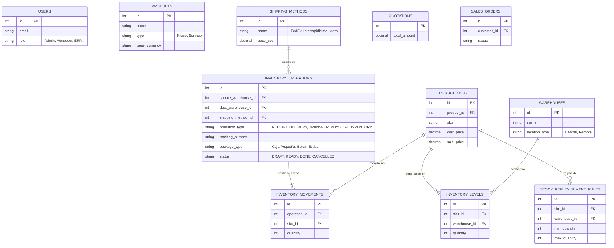

# Arquitectura de Base de Datos Central (Fase 1)

**Proyecto:** Nebulae ERP & CRM
**Módulo:** Cimientos / Core Architecture
**Inspiración:** Arquitectura tipo Odoo (Flexible y Escalable)
**Estado:** Evolutivo (Actualizado con Inventario Logístico Avanzado)

---

## 1. Gestión de Accesos (Usuarios y Permisos)
* **ROLES:** `Administrador`, `Vendedor`, `Gestión Interna (ERP)`, `Finanzas`, `Mercadeo`.
* **PERMISOS:** Control granular a través de `ROLE_PERMISSIONS`.

## 2. Catálogo Robusto (Estilo Odoo)
* Motor de atributos dinámicos (`ATTRIBUTES`, `ATTRIBUTE_VALUES`, `SKU_ATTRIBUTE_VALUES`) para permitir infinitas variaciones de producto (Color, Talla, Sabor, etc.).
* Múltiples imágenes HD por producto.

## 3. Logística e Inventario Avanzado (Operaciones Físicas)
Para soportar la complejidad logística de entregas, paquetes y reposiciones, el inventario funciona en 3 capas:
1. **Bodegas y Rutas (`WAREHOUSES`):** Control de bodegas centrales y remotas.
2. **Operaciones Logísticas (`INVENTORY_OPERATIONS`):** El documento físico (Albarán). Agrupa los movimientos y define si es una Recepción, Traslado Interno o Entrega. Aquí se define el **Método de Envío** y el **Tracking**.
3. **Movimientos / Kardex (`INVENTORY_MOVEMENTS`):** El detalle línea por línea (SKU y Cantidad) que pertenece a una Operación.
4. **Niveles y Reposición:** `INVENTORY_LEVELS` (Stock actual) y `STOCK_REPLENISHMENT_RULES` (Reglas de máximos y mínimos para re-abastecimiento automático).

## 4. Diagrama Entidad-Relación (ERD Avanzado)

